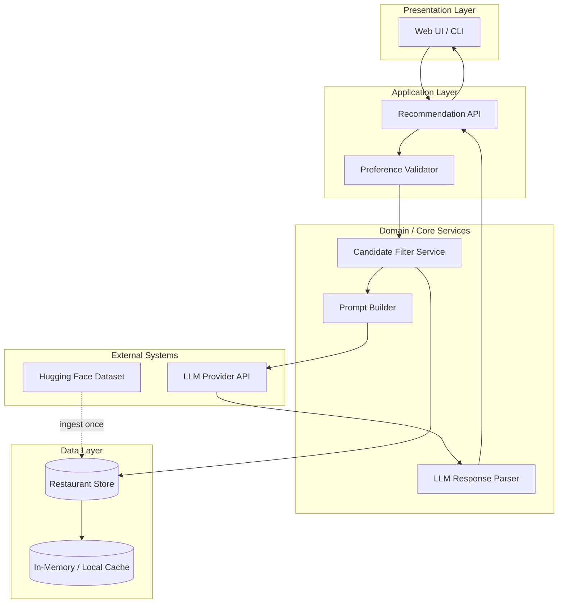
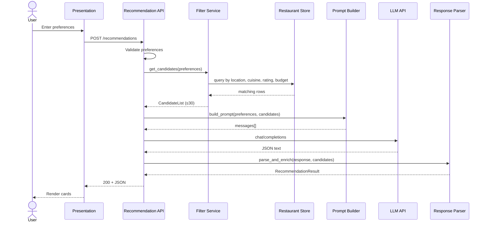
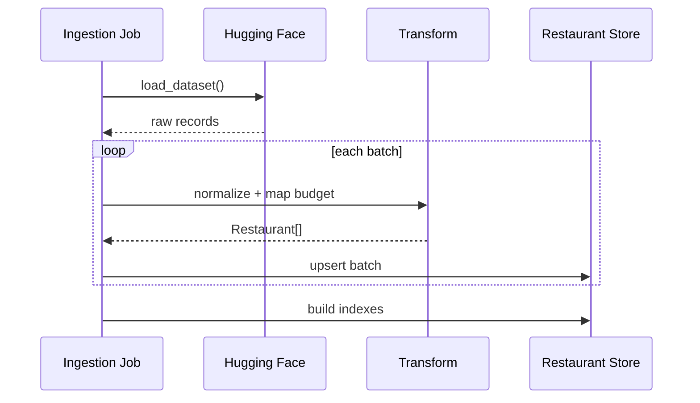
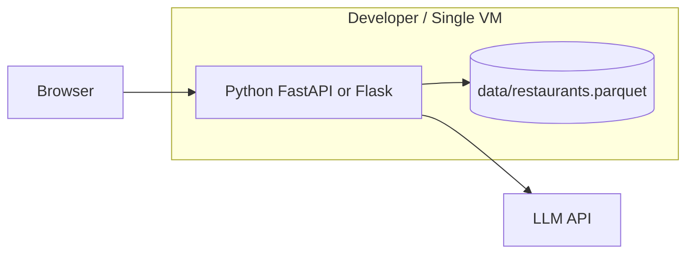

# System Architecture

> **Source:** [`docs/context.md`](./context.md) · [`docs/problemstatement.txt`](./problemstatement.txt)  
> **Generated:** 2026-05-17  
> **Status:** Design document — implementation stack is suggested, not mandated.

---

## 1. Purpose

This document describes the **technical architecture** for an AI-powered restaurant recommendation service (Zomato-inspired). It translates project objectives and functional requirements from [`context.md`](./context.md) into deployable components, data flows, interfaces, and operational concerns.

**Design principles:**

| Principle | Rationale |
|-----------|-----------|
| **Grounded recommendations** | LLM only ranks/explains restaurants from a pre-filtered candidate set (FR-4, FR-6). |
| **Separation of retrieval and reasoning** | Structured filtering reduces tokens, cost, and hallucination risk. |
| **Inspectable pipeline** | Each stage (ingest → filter → prompt → parse → display) is testable in isolation. |
| **Progressive complexity** | MVP can be CLI or single-page app; same core services scale to API + web UI. |

---

## 2. Goals & Non-Goals

### 2.1 Goals (from context)

- Accept user preferences: location, budget, cuisine, minimum rating, optional tags.
- Load and preprocess the [Zomato Hugging Face dataset](https://huggingface.co/datasets/ManikaSaini/zomato-restaurant-recommendation).
- Filter candidates, then use an LLM to rank, explain, and optionally summarize.
- Present top-N results: name, cuisine, rating, cost, AI explanation.

### 2.2 Non-Goals (explicit out of scope)

- User authentication, profiles, or recommendation history persistence.
- Live availability, reservations, maps, or delivery integration.
- Training or fine-tuning custom models (use hosted LLM APIs).
- Mobile-native clients (web or CLI is sufficient for MVP).

---

## 3. High-Level Architecture

### 3.1 Logical view



### 3.2 Layered responsibility

| Layer | Responsibility | Key artifacts |
|-------|----------------|----------------|
| **Presentation** | Collect preferences, render ranked results | HTML/React page, CLI form, result cards |
| **Application** | HTTP/CLI orchestration, validation, error handling | `POST /recommendations`, request DTOs |
| **Domain** | Filtering rules, budget mapping, prompt contracts | Filter service, prompt templates |
| **Data** | Normalized restaurant records, indexes for filter | Parquet/JSON/SQLite, city/cuisine indexes |
| **Integration** | Dataset load, LLM calls | `datasets` loader, Groq client |

---

## 4. Component Design

### 4.1 Data Ingestion Service

**Maps to:** FR-1, FR-2 · Workflow step 1 (Data Ingestion)

| Aspect | Design |
|--------|--------|
| **Input** | Hugging Face dataset `ManikaSaini/zomato-restaurant-recommendation` |
| **Output** | Normalized `Restaurant` records in local store |
| **Trigger** | One-time or scheduled job at startup / deploy |
| **Library** | `datasets` (Hugging Face), `pandas` for transform |

**Processing pipeline:**

```
Raw HF rows → schema discovery → field mapping → normalization → validation → persist
```

**Normalization rules (conceptual):**

- **Location:** trim, title-case city/area; build `location_normalized` for matching.
- **Area vs city split:** store **locality/area** (e.g. `Indiranagar`, `Bellandur`) in `location` and store the **city** (e.g. `Bangalore`) in `location_normalized`. The UI location dropdown should use `location` (areas), not `location_normalized` (city).
- **Cuisine:** split multi-value strings (e.g. `"Italian, Pizza"`) → list; primary cuisine for filters.
- **Rating:** coerce to float; drop or flag invalid rows.
- **Cost:** map raw cost field to numeric `cost_for_two` (or equivalent) and derive `budget_tier`: `low` \| `medium` \| `high` via percentiles or fixed thresholds (open question in context — configurable in config).
- **Name:** required; dedupe key optional `(name, location)`.

**Failure handling:**

- Log and skip malformed rows; fail ingest if &lt; threshold % of rows valid.
- Version dataset snapshot (hash or date) for reproducibility.

---

### 4.2 Restaurant Store

**Maps to:** FR-2, FR-4

| Option | When to use |
|--------|-------------|
| **In-memory list + indexes** | MVP, dataset &lt; ~100k rows, single process |
| **SQLite** | Local dev, simple queries, no extra infra |
| **Parquet + DuckDB/pandas** | Analytics-friendly, fast column filters |

**Suggested canonical record (`Restaurant`):**

```json
{
  "id": "string",
  "name": "string",
  "location": "string",
  "location_normalized": "string",
  "cuisines": ["string"],
  "rating": 4.2,
  "cost_estimate": 800,
  "budget_tier": "medium",
  "raw_attributes": {}
}
```

**Indexes (logical):**

- `location_normalized`
- `cuisines` (multi-value)
- `rating` (range queries)
- `budget_tier`

---

### 4.3 Preference Model & Validation

**Maps to:** FR-3 · Workflow step 2 (User Input)

**Input DTO (`UserPreferences`):**

| Field | Type | Required | Validation |
|-------|------|----------|------------|
| `location` | string | yes | non-empty; should match a known **area/locality** returned by `GET /api/v1/locations` |
| `budget` | enum | yes | `low` \| `medium` \| `high` |
| `cuisine` | string | yes | non-empty |
| `min_rating` | float | no | 0–5 if provided |
| `extras` | string[] | no | free text, e.g. `"family-friendly"`, `"quick service"` |
| `top_n` | int | no | default 5, max 20 |

Validator returns structured errors (field-level) before any filter or LLM call.

---

### 4.4 Candidate Filter Service

**Maps to:** FR-4 · Workflow step 3 (Integration Layer — filter half)

**Purpose:** Reduce full dataset to a **bounded candidate list** (e.g. 20–50 rows) passed to the LLM.

**Filter sequence (recommended order):**

1. **Location** — exact or fuzzy match on `location_normalized` (case-insensitive contains or equality).
2. **Cuisine** — any cuisine in list contains user cuisine (case-insensitive).
3. **Minimum rating** — `rating >= min_rating` when set.
4. **Budget** — `budget_tier == user.budget`.
5. **Sort & cap** — sort by rating desc, then cost proximity; take top `CANDIDATE_LIMIT` (e.g. 30).

**Edge cases:**

| Case | Behavior |
|------|----------|
| Zero matches after strict filters | Relax one constraint at a time (e.g. drop cuisine, then budget) with user-visible notice |
| Too many matches | Cap at `CANDIDATE_LIMIT`; LLM ranks within cap |
| Too few matches (&lt; 3) | Return all with message; optional widen location |

**Output:** `CandidateList { preferences, restaurants[], metadata }` — metadata includes filter stats and relaxations applied.

---

### 4.5 Prompt Builder & LLM Gateway

**Maps to:** FR-5, FR-6, FR-7 · Workflow steps 3–4

#### 4.5.1 Prompt strategy

Two-stage pattern (recommended):

| Stage | Actor | Role |
|-------|-------|------|
| **Retrieval** | Filter service | Deterministic, fast, explainable shortlist |
| **Ranking + NLG** | LLM | Order shortlist, write explanations, optional summary |

**System prompt (intent):**

- You are a restaurant recommendation assistant.
- Only recommend restaurants from the provided JSON list; do not invent venues.
- Rank by fit to user preferences; cite rating, cost, cuisine in explanations.
- Output **strict JSON** matching the response schema.

**User prompt contents:**

- Serialized `UserPreferences`
- Array of candidate `Restaurant` objects (minimal fields to save tokens)
- Instructions: return top `top_n`, per-item `explanation`, optional `summary`

#### 4.5.2 Response schema (contract)

```json
{
  "summary": "optional string",
  "recommendations": [
    {
      "restaurant_id": "string",
      "rank": 1,
      "explanation": "string"
    }
  ]
}
```

Post-processing **joins** `restaurant_id` back to store for display fields (name, cuisine, rating, cost).

#### 4.5.3 LLM gateway responsibilities

- API key from environment (`LLM_API_KEY`)
- Timeouts (e.g. 30s), retries with backoff (max 2)
- Token budgeting: truncate candidate list if prompt exceeds limit
- Model selection via config (`LLM_MODEL`)
- Logging: prompt hash, latency, token usage (no PII in logs)

**Hallucination guardrails:**

- Reject LLM IDs not in candidate set; map by name fallback only if unique match.
- If parse fails, retry once with “JSON only” reminder; else return deterministic fallback (top-N by rating with template explanations).

---

### 4.6 Response Parser & Enricher

**Maps to:** FR-6, FR-8

- Parse JSON from LLM (strip markdown fences if present).
- Validate schema; enrich each item with full `Restaurant` fields.
- Build `RecommendationResult` for API/UI.

**Display model (`RecommendationResult`):**

| Field | Source |
|-------|--------|
| `name`, `cuisine`, `rating`, `estimated_cost` | Restaurant store |
| `explanation` | LLM |
| `rank` | LLM |
| `summary` | LLM (optional) |

---

### 4.7 Presentation Layer

**Maps to:** FR-8 · Workflow step 5 (Output Display)

**Option A — Web application (recommended for demo)**

```
Browser → static/form page → REST API → JSON results → result cards
```

**Option B — CLI (fastest MVP)**

```
stdin preferences → core pipeline → stdout table
```

**UI components:**

- Preference form (location, budget dropdown, cuisine, min rating, extras textarea)
- Loading state during LLM call
- Results: card per restaurant with explanation; optional summary banner
- Error states: validation, no results, LLM timeout

---

### 4.8 Recommendation API (Application orchestrator)

**Maps to:** All FRs — single entry for web/CLI

**Suggested endpoint:**

```
POST /api/v1/recommendations
Content-Type: application/json

Request:  UserPreferences
Response: RecommendationResult
```

**Supporting endpoint (for UI dropdowns):**

```
GET /api/v1/locations
Response: { "locations": ["Indiranagar", "Bellandur", "Koramangala", "..."] }
```

**Orchestration flow:**

```
validate → filter → build_prompt → call_llm → parse → enrich → respond
```

**Errors:**

| HTTP | Condition |
|------|-----------|
| 400 | Validation failure |
| 404 | No candidates after relaxations |
| 502 | LLM provider error |
| 504 | LLM timeout |

---

## 5. Data Flow

### 5.1 End-to-end request flow



### 5.2 Startup / ingest flow



---

## 6. Deployment Architecture

### 6.1 MVP (single machine)



- Ingest runs on first start or via `python -m ingest`.
- No database server required for MVP.
- Secrets via `.env` (never committed).

### 6.2 Production-oriented (optional evolution)

| Component | Suggestion |
|-----------|------------|
| API | Containerized FastAPI behind reverse proxy |
| Data | PostgreSQL or managed SQLite replica |
| Cache | Redis for hot city/cuisine filter results |
| LLM | Provider SDK + circuit breaker |
| Observability | Structured logs, request ID, metrics (latency, filter hit rate) |

---

## 7. Project Structure (Suggested)

```
restaurant-recommender/
├── docs/
│   ├── context.md
│   ├── architecture.md
│   └── problemstatement.txt
├── src/
│   ├── ingest/
│   │   ├── loader.py          # HF dataset load
│   │   └── normalize.py       # field mapping, budget tiers
│   ├── data/
│   │   ├── models.py          # Restaurant, UserPreferences
│   │   └── store.py           # query interface
│   ├── services/
│   │   ├── filter.py          # CandidateFilterService
│   │   ├── prompt.py          # PromptBuilder
│   │   └── llm.py             # LLM gateway
│   ├── api/
│   │   ├── routes.py          # POST /recommendations
│   │   └── schemas.py         # request/response DTOs
│   └── main.py
├── web/                       # optional static UI
├── config/
│   └── settings.py            # thresholds, model name, limits
├── scripts/
│   └── run_ingest.py
├── tests/
│   ├── test_filter.py
│   ├── test_prompt.py
│   └── test_parser.py
├── .env.example
└── requirements.txt
```

---

## 8. Configuration

| Key | Description | Example |
|-----|-------------|---------|
| `DATASET_NAME` | Hugging Face dataset id | `ManikaSaini/zomato-restaurant-recommendation` |
| `DATA_PATH` | Local snapshot path | `./data/restaurants.parquet` |
| `CANDIDATE_LIMIT` | Max rows to LLM | `30` |
| `DEFAULT_TOP_N` | Recommendations returned | `5` |
| `BUDGET_LOW_MAX` | Cost upper bound for `low` | configurable after schema discovery |
| `BUDGET_MEDIUM_MAX` | Cost upper bound for `medium` | configurable |
| `LLM_PROVIDER` | Provider id | `groq` |
| `LLM_MODEL` | Model name | `llama3-8b-8192` |
| `LLM_TIMEOUT_SEC` | Request timeout | `30` |

---

## 9. Security & Privacy

| Concern | Mitigation |
|---------|------------|
| API keys | Environment variables only; `.env` in `.gitignore` |
| User input | Sanitize strings; max length on `extras`; no shell execution |
| LLM data leakage | Send only necessary candidate fields; no internal paths in prompts |
| Dependency risk | Pin versions in `requirements.txt`; periodic audit |
| Rate limiting | Optional on public API to control LLM cost |

No authentication in MVP; if exposed publicly, add API key or rate limits before production.

---

## 10. Performance & Cost

| Stage | Target | Notes |
|-------|--------|-------|
| Filter | &lt; 100 ms | In-memory / indexed local store |
| LLM call | 2–15 s | Dominant latency; show loading UI |
| End-to-end | &lt; 20 s p95 | Timeout + friendly error |

**Cost control:**

- Cap candidates at 20–30 restaurants per request.
- Use smaller/cheaper model for MVP (e.g., `llama3-8b-8192` via Groq).
- Cache ingest locally to avoid repeated HF downloads.

---

## 11. Testing Strategy

| Level | Focus |
|-------|--------|
| **Unit** | Budget tier mapping, filter logic, JSON parser, prompt template snapshots |
| **Integration** | Mock LLM returns fixed JSON; full pipeline assert enriched output |
| **Contract** | LLM response schema validation; reject unknown `restaurant_id` |
| **E2E** | CLI or API with test fixture data (subset of dataset) |

**Golden tests:** Fixed preferences + fixed candidate file → expected top-3 IDs (with mocked LLM).

---

## 12. Requirements Traceability

| Req ID | Architectural element |
|--------|------------------------|
| FR-1 | Data Ingestion Service + HF loader |
| FR-2 | Normalization pipeline + Restaurant Store schema |
| FR-3 | UserPreferences DTO + Validator |
| FR-4 | Candidate Filter Service |
| FR-5 | Prompt Builder |
| FR-6 | LLM Gateway + Response Parser |
| FR-7 | Optional `summary` in LLM schema |
| FR-8 | Presentation Layer + RecommendationResult |

---

## 13. Risks & Mitigations

| Risk | Impact | Mitigation |
|------|--------|------------|
| Unknown HF schema | Ingest fails or wrong filters | Schema discovery step; configurable column mapping |
| LLM invents restaurants | Bad UX, trust loss | ID whitelist from candidates; structured JSON output |
| Ambiguous location strings | Empty results | Normalization + fuzzy match + relaxation policy |
| High LLM latency/cost | Slow or expensive | Candidate cap, smaller model, caching common queries later |
| Budget mapping arbitrary | Wrong tier | Document thresholds; make config-driven |

---

## 14. Open Decisions (from context)

Track these during implementation; defaults are suggested below.

| Question | Suggested default |
|----------|-------------------|
| Exact HF column names | Discover on first ingest; document in `data/schema.md` |
| Budget tier mapping | Percentiles per city or global: low &lt; 33%, medium &lt; 66% |
| UI stack | FastAPI + simple HTML/HTMX or React SPA |
| LLM provider | Groq API; abstract behind `LLMGateway` interface |
| Top N | Default 5, max 10 in UI |

---

## 15. Related Documents

| Document | Role |
|----------|------|
| [`docs/context.md`](./context.md) | Product context, FRs, workflow |
| [`docs/problemstatement.txt`](./problemstatement.txt) | Original brief |
| `docs/architecture.md` | This file — technical design |

---

## Appendix A: Example API Contract

**Request**

```http
POST /api/v1/recommendations
Content-Type: application/json

{
  "location": "Bangalore",
  "budget": "medium",
  "cuisine": "Italian",
  "min_rating": 4.0,
  "extras": ["family-friendly"],
  "top_n": 5
}
```

**Response**

```json
{
  "summary": "These Italian spots in Bangalore balance ratings and mid-range pricing.",
  "recommendations": [
    {
      "rank": 1,
      "name": "Example Trattoria",
      "cuisine": "Italian",
      "rating": 4.5,
      "estimated_cost": 1200,
      "explanation": "Highly rated Italian cuisine within your medium budget, suitable for families."
    }
  ],
  "metadata": {
    "candidates_considered": 28,
    "filters_relaxed": []
  }
}
```

---

## Appendix B: Prompt Template (Sketch)

```
System: You recommend only from the CANDIDATES list. Output valid JSON matching SCHEMA.

User:
PREFERENCES: {json preferences}
CANDIDATES: {json array max 30 items}
Return top {top_n} with rank, restaurant_id, explanation. Optional summary field.
SCHEMA: {json schema}
```
