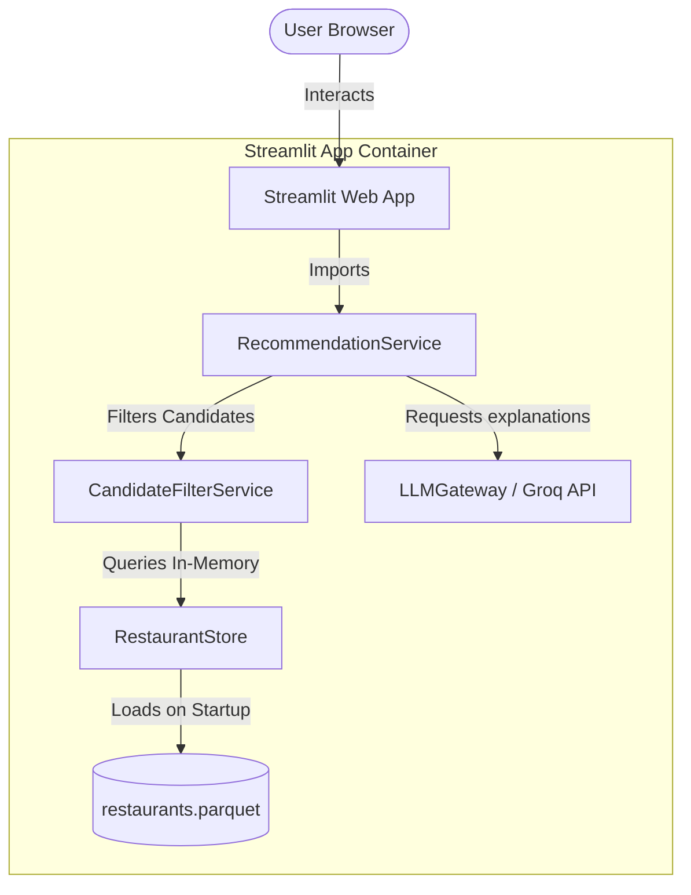

# Streamlit Deployment Plan

This document outlines the architecture, implementation, and deployment steps for launching the **Zomato Restaurant Recommendation Model** as a unified Python web application using **Streamlit**.

---

## 1. Architecture Overview

Streamlit is a Python-based framework that allows us to build web interfaces without writing HTML/JS/CSS. By adopting Streamlit, we can simplify our hosting from a two-tier backend (FastAPI) + frontend (React/Vite) stack into a **single unified Python application**.



### Advantages
- **No REST API overhead:** Streamlit directly calls the Python database store and orchestrator in-memory.
- **Single deployment:** We only deploy one Python script (`streamlit_app.py`) on Streamlit Community Cloud or any Cloud VM.
- **Easy secrets management:** Streamlit handles Groq API keys and environment configurations natively.

---

## 2. Streamlit Application Implementation

To deploy on Streamlit, we will create a `streamlit_app.py` file in the project root. Below is the proposed code structure that replicates the **FlavorIQ** preference inputs, results list, and detailed cards.

### `streamlit_app.py` Structure
```python
import streamlit as st
import pandas as pd
from pathlib import Path
from src.data.store import RestaurantStore
from src.data.preferences import UserPreferences
from src.data.models import BudgetTier
from src.services.orchestrator import RecommendationService, OrchestrationError

# 1. Page Configuration & Custom CSS (Sleek Dark Theme)
st.set_page_config(
    page_title="FlavorIQ - AI Restaurant Recommender",
    page_icon="✨",
    layout="wide",
    initial_sidebar_state="expanded"
)

# Custom CSS injection for premium glassmorphism aesthetics
st.markdown("""
    <style>
    .reportview-container {
        background: linear-gradient(135deg, #0f172a 0%, #1e293b 50%, #0f172a 100%);
    }
    .restaurant-card {
        background: rgba(30, 41, 59, 0.7);
        backdrop-filter: blur(12px);
        border: 1px solid rgba(255, 255, 255, 0.1);
        border-radius: 16px;
        padding: 24px;
        margin-bottom: 20px;
        position: relative;
    }
    .rank-badge {
        position: absolute;
        top: 15px;
        right: 15px;
        background: linear-gradient(135deg, #f43f5e, #f97316);
        color: white;
        border-radius: 50%;
        width: 35px;
        height: 35px;
        display: flex;
        align-items: center;
        justify-content: center;
        font-weight: bold;
    }
    .reasoning-box {
        background: rgba(15, 23, 42, 0.5);
        border-left: 4px solid #f43f5e;
        padding: 12px;
        border-radius: 8px;
        margin-top: 15px;
    }
    </style>
""", unsafe_allow_html=True)

# 2. Cache Data Loading
@st.cache_resource
def get_service():
    # Cache the database load so it only reads parquet once on startup
    data_path = Path("data/restaurants.parquet")
    store = RestaurantStore.from_parquet(data_path)
    return RecommendationService(store)

try:
    service = get_service()
    store = service._store
except Exception as e:
    st.error(f"Failed to load data store: {e}")
    st.stop()

# 3. Sidebar (Preferences Form)
with st.sidebar:
    st.image("https://img.icons8.com/color/96/sparkling.png", width=60)
    st.title("FlavorIQ")
    st.caption("AI-powered culinary intelligence for your dining experience")
    st.markdown("---")
    
    st.subheader("Your Preferences")
    
    # Location Selection
    locations = store.known_locations(limit=100)
    selected_location = st.selectbox("Location", options=locations)
    
    # Cuisine Input
    selected_cuisine = st.text_input("Cuisine", placeholder="e.g. Italian, North Indian")
    
    # Budget Tier Selector
    selected_budget = st.selectbox("Budget Tier", options=["low", "medium", "high"], index=1)
    
    # Rating Slider
    min_rating = st.slider("Minimum Rating", min_value=0.0, max_value=5.0, value=3.5, step=0.1)
    
    # Extras tag list
    extras_input = st.text_input("Extras (Optional, comma-separated)", placeholder="e.g. romantic, outdoor seating")
    
    st.markdown("---")
    submit_btn = st.button("Find Recommendations", use_container_width=True, type="primary")

# 4. Main Panel Layout
if submit_btn:
    if not selected_cuisine:
        st.warning("Please enter at least one cuisine.")
    else:
        with st.spinner("AI is analyzing local matches..."):
            cuisines_list = [c.strip() for c in selected_cuisine.split(",") if c.strip()]
            extras_list = [e.strip() for e in extras_input.split(",") if e.strip()] if extras_input else []
            
            prefs = UserPreferences(
                location=selected_location,
                budget=BudgetTier(selected_budget),
                cuisines=cuisines_list,
                min_rating=min_rating,
                extras=extras_list,
                top_n=5
            )
            
            try:
                result = service.recommend(prefs)
                
                # Header Summary
                if result.summary:
                    st.success(f"✨ **AI Summary:** {result.summary}")
                
                # Warnings & Notice
                if result.metadata.warnings:
                    for warning in result.metadata.warnings:
                        st.info(f"⚠️ {warning}")
                
                # Recommendations Feed
                for rec in result.recommendations:
                    st.markdown(f"""
                        <div class="restaurant-card">
                            <div class="rank-badge">#{rec.rank}</div>
                            <h3 style="margin-top:0; color:white; font-size: 1.4rem;">{rec.name}</h3>
                            <p style="color: #94a3b8; font-size: 0.9rem; margin-bottom: 8px;">
                                🍽️ {rec.cuisine} &nbsp;|&nbsp; ⭐ {rec.rating:.1f} &nbsp;|&nbsp; 💰 ₹{rec.estimated_cost or 500:.0f} for two
                            </p>
                            <div class="reasoning-box">
                                <p style="margin: 0; font-style: italic; color: #e2e8f0; font-size: 0.95rem;">
                                    "{rec.explanation}"
                                </p>
                            </div>
                        </div>
                    """, unsafe_allow_html=True)
                    
            except OrchestrationError as e:
                st.error(f"Recommendation Failed: {e.message}")
            except Exception as e:
                st.error(f"Something went wrong: {e}")
```

---

## 3. Step-by-Step Deployment on Streamlit Community Cloud

Streamlit Community Cloud offers free hosting directly connected to a public GitHub repository.

### Step 3.1: Prepare the Files
Make sure the following files are present in the GitHub repository:
1. `streamlit_app.py` in the root directory.
2. `requirements.txt` containing dependencies:
   ```text
   streamlit>=1.30.0
   pydantic>=2.9.0
   pydantic-settings>=2.6.0
   pandas>=2.2.0
   pyarrow>=18.0.0
   datasets>=3.1.0
   python-dotenv>=1.0.0
   httpx>=0.27.0
   pyyaml>=6.0.0
   ```
3. `data/restaurants.parquet` is **NOT** committed to git (due to size). The app needs to pull the data or run ingest during setup.
   > **Important:** To handle the database on the serverless platform, either check in a compact parquet file under `data/` or add a fallback code inside `streamlit_app.py` that downloads the dataset directly from Hugging Face on the first run.

### Step 3.2: Configure Secrets
Streamlit Cloud requires our API keys to be securely stored.
1. Create a `.streamlit/secrets.toml` locally (gitignored) for testing:
   ```toml
   LLM_API_KEY = "gsk_YourGroqApiKeyHere..."
   LLM_MODEL = "llama3-8b-8192"
   ```
2. On Streamlit Community Cloud Dashboard:
   - Go to your App settings -> **Secrets**.
   - Paste the contents of your `secrets.toml` directly into the text field.

### Step 3.3: Deploy the App
1. Go to [share.streamlit.io](https://share.streamlit.io/).
2. Click **New App**.
3. Select your repository, branch (e.g. `main`), and specify the Main file path: `streamlit_app.py`.
4. Click **Deploy!**

Your web recommender will be live at a public URL (e.g. `https://flavoriq.streamlit.app`) in a couple of minutes!
