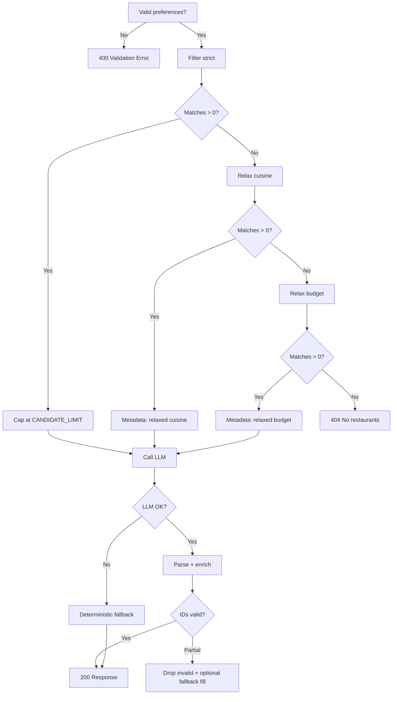

# Edge Cases & Handling Guide

> **Sources:** [`docs/context.md`](./context.md) · [`docs/architecture.md`](./architecture.md) · [`docs/implementation-plan.md`](./implementation-plan.md)  
> **Generated:** 2026-05-17  
> **Purpose:** Catalog abnormal inputs, data quality issues, and failure modes with **expected system behavior** for implementers and testers.

---

## How to Use This Document

| Column | Meaning |
|--------|---------|
| **ID** | Stable reference (`EC-<area>-<nn>`) for tests and issues |
| **Phase** | Implementation phase from [`implementation-plan.md`](./implementation-plan.md) |
| **Layer** | Component per [`architecture.md`](./architecture.md) |
| **Severity** | `Critical` (wrong/unsafe output), `High` (broken flow), `Medium` (degraded UX), `Low` (cosmetic) |

Each edge case specifies **detection**, **handling**, **user-facing message** (API/UI), and **test hint**.

---

## Summary Matrix

| Area | Count | Primary phase |
|------|-------|----------------|
| Data ingestion & store | 18 | 1 |
| User preferences & validation | 16 | 2–3 |
| Candidate filter | 14 | 2 |
| LLM, prompt & parser | 20 | 4 |
| API & orchestration | 12 | 5 |
| Presentation (CLI & web) | 10 | 3, 6 |
| Startup, config & infra | 10 | 0–1, 5, 7 |
| Security & abuse | 8 | 7 |
| **Total** | **108** | |

---

## 1. Data Ingestion & Store

### 1.1 Hugging Face & raw dataset

| ID | Scenario | Severity | Handling | User/API impact | Test |
|----|----------|----------|----------|-----------------|------|
| EC-DATA-01 | HF dataset unreachable (network, 404) | Critical | Ingest fails with clear error; do not start API with empty store unless `ALLOW_EMPTY_STORE=true` | Health: `503` + `"Dataset unavailable"` | Mock network failure |
| EC-DATA-02 | HF schema changed (columns renamed/removed) | Critical | Schema discovery fails mapping; abort ingest; log missing columns | Block startup; document in `data/schema.md` | Fixture with wrong columns |
| EC-DATA-03 | Empty dataset returned | Critical | Fail ingest; log `0 rows` | Same as EC-DATA-01 | Empty HF split mock |
| EC-DATA-04 | Partial download / corrupted cache | High | Retry download once; clear HF cache on second failure | Ingest script exit 1 | Simulate corrupt parquet |
| EC-DATA-05 | Dataset version drift between runs | Medium | Log dataset revision/hash in `data/schema.md`; warn if row count changes &gt; 20% | None (ops log) | Two ingest runs compare hash |

### 1.2 Row-level normalization

| ID | Scenario | Severity | Handling | User/API impact | Test |
|----|----------|----------|----------|-----------------|------|
| EC-DATA-06 | Missing restaurant name | High | Skip row; increment `skipped_count` | None | Row without name |
| EC-DATA-07 | Missing location | High | Skip row or assign `"Unknown"` + flag `location_missing` (prefer skip for filter accuracy) | Filter may not match | Row without location |
| EC-DATA-08 | Invalid rating (non-numeric, &lt; 0, &gt; 5) | Medium | Skip or clamp: if &gt; 5 and looks like 10-scale, divide by 2 once; else skip | None at ingest | `"rating": "N/A"`, `4.6/5` |
| EC-DATA-09 | Missing cost field | Medium | Set `cost_estimate=null`, `budget_tier="medium"` default OR exclude from budget filter only | Budget filter may misclassify | Null cost rows |
| EC-DATA-10 | Cost as range string (`"300-500"`) | Medium | Parse midpoint or lower bound; log parse method | Budget tier derived from midpoint | String cost formats |
| EC-DATA-11 | Multi-cuisine string (`"Italian, Pizza, Fast Food"`) | Low | Split on `,` / `;`; trim; dedupe list | Cuisine filter uses token match | Combined cuisine field |
| EC-DATA-12 | Duplicate `(name, location)` rows | Medium | Keep highest rating or first; log duplicate count | Deduped store | Duplicate fixture rows |
| EC-DATA-13 | Special characters / Unicode in name | Low | Preserve UTF-8; normalize NFC for display | Display as-is | Names with é, दिल्ली |
| EC-DATA-14 | Extremely long text fields | Low | Truncate to max length (e.g. 500 chars) at ingest | None | 10k char name |

### 1.3 Budget tier assignment

| ID | Scenario | Severity | Handling | User/API impact | Test |
|----|----------|----------|----------|-----------------|------|
| EC-DATA-15 | All restaurants same cost in a city | Medium | All same tier OR use global percentiles; document in `data/schema.md` | Budget filter may return all or none | Flat cost city |
| EC-DATA-16 | City with &lt; 10 rows for percentiles | Medium | Fall back to **global** percentiles for that city | Metadata note optional | Small city slice |
| EC-DATA-17 | User budget tier has zero restaurants in city | High | Handled at filter layer (relaxation) — see EC-FILTER-01 | 404 or relaxed results | Bangalore + only `high` tier data |

### 1.4 Store load & query

| ID | Scenario | Severity | Handling | User/API impact | Test |
|----|----------|----------|----------|-----------------|------|
| EC-DATA-18 | `DATA_PATH` missing at startup | Critical | Auto-ingest if configured OR fail health with `"Run ingest first"` | `GET /health` → 503 | Delete parquet |

---

## 2. User Preferences & Validation

**Layer:** `UserPreferences` validator · FR-3 · Architecture §4.3

| ID | Scenario | Severity | Handling | HTTP | User message | Phase |
|----|----------|----------|----------|------|--------------|-------|
| EC-INPUT-01 | Empty `location` | High | Reject before filter | 400 | `"location is required"` | 2 |
| EC-INPUT-02 | `location` whitespace only | High | Trim; if empty after trim → 400 | 400 | Same as EC-INPUT-01 | 2 |
| EC-INPUT-03 | Unknown city (no match in dataset) | High | Allow request; filter returns 0 → relaxation → 404 | 404 | `"No restaurants found for location 'X'. Try Delhi or Bangalore."` | 2 |
| EC-INPUT-04 | Location alias (`"Bengaluru"` vs `"Bangalore"`) | Medium | Normalize via alias map in config OR fuzzy match on `location_normalized` | — | Suggest canonical name in metadata | 2 |
| EC-INPUT-05 | Case variation (`"delhi"`, `"DELHI"`) | Low | Case-insensitive match | — | — | 2 |
| EC-INPUT-06 | Invalid `budget` (not low/medium/high) | High | Pydantic enum validation | 400 | `"budget must be low, medium, or high"` | 2 |
| EC-INPUT-07 | Empty `cuisine` | High | Reject | 400 | `"cuisine is required"` | 2 |
| EC-INPUT-08 | Obscure cuisine (no dataset match) | High | Strict filter → 0 → relax cuisine (EC-FILTER-04) | 200 or 404 | `"No exact cuisine match; showing similar options."` in metadata | 2 |
| EC-INPUT-09 | `min_rating` omitted | Low | Skip rating filter | — | — | 2 |
| EC-INPUT-10 | `min_rating` &lt; 0 or &gt; 5 | High | Reject | 400 | `"min_rating must be between 0 and 5"` | 2 |
| EC-INPUT-11 | `min_rating` = 5.0 (very strict) | Medium | May return few/zero results → relaxation | 200/404 | Few results message | 2 |
| EC-INPUT-12 | `top_n` omitted | Low | Default `DEFAULT_TOP_N` (5) | — | — | 3 |
| EC-INPUT-13 | `top_n` = 0 or negative | High | Reject | 400 | `"top_n must be at least 1"` | 2 |
| EC-INPUT-14 | `top_n` &gt; 20 | High | Reject or clamp to 20 | 400 or clamp | `"top_n cannot exceed 20"` | 2 |
| EC-INPUT-15 | `extras` very long (&gt; 2000 chars) | Medium | Truncate to max length (e.g. 500) | — | — | 7 |
| EC-INPUT-16 | `extras` with prompt-injection patterns | High | Pass as opaque user text; system prompt forbids overriding rules; never execute | — | — | 4 |

---

## 3. Candidate Filter Service

**Layer:** `CandidateFilterService` · FR-4 · Architecture §4.4

### 3.1 Match volume (architecture-defined)

| ID | Scenario | Severity | Handling | Metadata | HTTP | Phase |
|----|----------|----------|----------|----------|------|-------|
| EC-FILTER-01 | **Zero matches** after strict filters | High | Relax in order: (1) cuisine, (2) budget, (3) optional min_rating −0.5; if still 0 → 404 | `filters_relaxed: ["cuisine", "budget"]` | 404 | 2 |
| EC-FILTER-02 | **Too many matches** (&gt; `CANDIDATE_LIMIT`) | Medium | Sort by rating desc, cost proximity; cap at 30 | `candidates_considered: 30`, `total_matches: N` | 200 | 2 |
| EC-FILTER-03 | **Too few matches** (&lt; 3) | Medium | Return all matches; do not pad with non-matches | `message: "Only N restaurants matched"` | 200 | 2 |
| EC-FILTER-04 | Zero matches even after full relaxation | High | 404 with suggestions (other cities/cuisines from store stats) | `filters_relaxed: ["all"]` | 404 | 2 |

### 3.2 Filter logic edge cases

| ID | Scenario | Severity | Handling | Notes | Test |
|----|----------|----------|----------|-------|------|
| EC-FILTER-05 | `min_rating` filters out all but 1 | Low | Return 1 candidate to LLM; `top_n` may be 1 | LLM asked for top 5 with 1 candidate | min_rating=4.9 |
| EC-FILTER-06 | Cuisine substring false positive (`"Thai"` in `"Italian"`) | Medium | Match whole token or word-boundary in cuisine list | Architecture risk | cuisine `"ai"` |
| EC-FILTER-07 | Location substring match (`"Del"` → Delhi) | Medium | Prefer equality on normalized city; fuzzy only if configured | Ambiguous locations | location `"Del"` |
| EC-FILTER-08 | Restaurant with `rating=null` | Medium | Exclude from min_rating filter OR treat as 0 | Document choice | null rating rows |
| EC-FILTER-09 | Restaurant with `budget_tier=null` | Medium | Exclude from budget filter when strict; include after budget relaxation | — | null tier |
| EC-FILTER-10 | User `extras` not in structured data | Low | Pass to LLM only; do not filter on extras in MVP | FR-4 is structured filters only | extras `"rooftop"` |
| EC-FILTER-11 | Exactly `CANDIDATE_LIMIT` matches | Low | Pass all without truncation message | — | boundary count |
| EC-FILTER-12 | Single match, `top_n`=5 | Low | LLM returns 1 item; UI shows 1 card | — | — |
| EC-FILTER-13 | Tie ratings on sort | Low | Secondary sort: cost proximity to tier midpoint, then name asc | Deterministic order | equal ratings |
| EC-FILTER-14 | Concurrent filter calls (same process) | Low | Read-only store; thread-safe if async API | — | load test optional |

---

## 4. LLM, Prompt & Parser

**Layer:** Prompt Builder, LLM Gateway, Parser · FR-5–7 · Architecture §4.5–4.6

### 4.1 Prompt & token limits

| ID | Scenario | Severity | Handling | Fallback | Phase |
|----|----------|----------|----------|----------|-------|
| EC-LLM-01 | Prompt exceeds model context | High | Drop lowest-rated candidates until under limit; min 5 candidates | Log truncation | 4 |
| EC-LLM-02 | Empty candidate list reaches LLM (bug) | Critical | Never call LLM; return 404 at orchestrator | — | 5 |
| EC-LLM-03 | 1–2 candidates only | Low | Prompt: "Return up to {top_n} from available only" | Fewer results OK | 4 |
| EC-LLM-04 | `extras` conflict with candidates (e.g. "vegan" but none) | Medium | LLM explains limitation in summary/explanation | No fake venues | 4 |

### 4.2 LLM provider failures

| ID | Scenario | Severity | Handling | HTTP | User message | Phase |
|----|----------|----------|----------|------|--------------|-------|
| EC-LLM-05 | Missing `LLM_API_KEY` | Critical | Fail at startup or first call with config error | 503 | `"Recommendation service not configured"` | 4 |
| EC-LLM-06 | Invalid API key (401) | High | No retry; log error | 502 | `"AI service authentication failed"` | 4 |
| EC-LLM-07 | Rate limit (429) | High | Retry once with backoff; then fallback | 502 or 200 fallback | `"High demand; showing rating-based picks"` | 4 |
| EC-LLM-08 | Timeout (&gt; `LLM_TIMEOUT_SEC`) | High | Retry once; then deterministic fallback | 504 or 200 fallback | `"Request timed out; showing top-rated matches"` | 4 |
| EC-LLM-09 | Provider 5xx | High | Retry once (max 2 total); then fallback | 502 or 200 fallback | Same as EC-LLM-08 | 4 |
| EC-LLM-10 | Network unreachable | High | Same as timeout | 502 | Connection error message | 4 |

### 4.3 Response parsing & hallucination

| ID | Scenario | Severity | Handling | Phase |
|----|----------|----------|----------|-------|
| EC-LLM-11 | LLM returns markdown-wrapped JSON | Medium | Strip ` ```json ` fences before parse | 4 |
| EC-LLM-12 | Invalid JSON | High | Retry once with "JSON only"; else deterministic fallback | 4 |
| EC-LLM-13 | Valid JSON, schema mismatch (missing fields) | High | Reject invalid items; fill from fallback for missing slots | 4 |
| EC-LLM-14 | **`restaurant_id` not in candidate set** | Critical | Drop item; log hallucination; never display | 4 |
| EC-LLM-15 | Duplicate `restaurant_id` in response | Medium | Keep first by rank; dedupe | 4 |
| EC-LLM-16 | Duplicate ranks (two `rank: 1`) | Low | Re-number sequentially by array order | 4 |
| EC-LLM-17 | Fewer items than `top_n` | Low | Return what LLM gave; no padding with invented rows | 4 |
| EC-LLM-18 | More items than `top_n` | Medium | Truncate to `top_n` by rank | 4 |
| EC-LLM-19 | Empty `explanation` string | Medium | Template: `"Recommended based on your preferences."` | 4 |
| EC-LLM-20 | Name-only match fallback (ID wrong, name unique) | Medium | Map only if exactly one candidate name match; else drop | 4 |

### 4.4 Deterministic fallback (when LLM fails)

| ID | Scenario | Severity | Handling | User-visible |
|----|----------|----------|----------|--------------|
| EC-LLM-21 | Fallback path activated | Medium | Top-N by rating from candidates; template explanations | `metadata.llm_fallback: true` |
| EC-LLM-22 | Optional `summary` missing | Low | Omit summary or generate template: `"Top picks in {location} for {cuisine}."` | FR-7 optional |

---

## 5. API & Orchestration

**Layer:** Recommendation API · Architecture §4.8

| ID | Scenario | Severity | Handling | HTTP | Response body |
|----|----------|----------|----------|------|-----------------|
| EC-API-01 | Malformed JSON body | High | Pydantic/FastAPI validation | 422 | Field errors |
| EC-API-02 | Wrong Content-Type | Medium | Reject or attempt parse | 415/400 | Clear message |
| EC-API-03 | Extra unknown JSON fields | Low | Ignore (`model_config` extra=ignore) | 200 | — |
| EC-API-04 | `GET` on POST-only endpoint | Low | 405 Method Not Allowed | 405 | — |
| EC-API-05 | Health check, store not loaded | Critical | 503 | 503 | `{"status":"degraded","reason":"no data"}` |
| EC-API-06 | Health check, store OK, no LLM key | Medium | 200 with warning flag OR 503 if strict | 200/503 | `llm_configured: false` |
| EC-API-07 | Unhandled exception in orchestrator | Critical | Log stack trace; generic message | 500 | `"Internal server error"` |
| EC-API-08 | Response enrichment: ID deleted mid-request | Low | Should not happen; skip item if store miss | 200 | Partial results |
| EC-API-09 | `top_n` &gt; candidate count | Low | Return `len(candidates)` max | 200 | — |
| EC-API-10 | Very large request body | Medium | Reject &gt; 64KB | 413 | — |
| EC-API-11 | CORS preflight from web UI | Low | Allow configured origins | 204 | Phase 5–6 |
| EC-API-12 | Parallel duplicate POSTs | Low | Each independent; no dedup in MVP | 200 each | — |

---

## 6. Presentation Layer (CLI & Web)

**Maps to:** FR-8 · Phase 3, 6

| ID | Scenario | Severity | Handling | Surface |
|----|----------|----------|----------|---------|
| EC-UI-01 | CLI missing required flag | High | argparse error; exit code 1 | CLI stderr |
| EC-UI-02 | CLI invalid enum for budget | High | Exit 1 with hint | CLI |
| EC-UI-03 | Web form empty on submit | High | Client-side validation before fetch | Inline field errors |
| EC-UI-04 | API 404 displayed | High | Show message + suggest cities from static list or `/meta/cities` | Banner |
| EC-UI-05 | API 504 / network error | High | Retry button; do not show stale results | Error panel |
| EC-UI-06 | Long explanation text | Low | CSS `overflow-wrap`; max-height with expand | Card layout |
| EC-UI-07 | Zero recommendations (200 with empty array) | Medium | "No recommendations available" empty state | UI |
| EC-UI-08 | User double-clicks submit | Medium | Disable button until response (Phase 6.4) | Web |
| EC-UI-09 | `summary` present | Low | Show banner above cards | Web |
| EC-UI-10 | Missing optional fields in response (cost null) | Medium | Display `"N/A"` for estimated cost | Card |

---

## 7. Startup, Configuration & Infrastructure

| ID | Scenario | Severity | Handling | Phase |
|----|----------|----------|----------|-------|
| EC-CFG-01 | Invalid `CANDIDATE_LIMIT` (0, negative) | High | Fail at settings load | 0 |
| EC-CFG-02 | `BUDGET_*` thresholds inverted (low &gt; medium) | High | Fail validation at startup | 1 |
| EC-CFG-03 | Re-ingest while API running | Medium | Document: restart API after ingest; or hot-reload with file watcher (optional) | 1 |
| EC-CFG-04 | Disk full during parquet write | Critical | Ingest abort; partial file deleted | 1 |
| EC-CFG-05 | Out-of-memory loading full dataset | High | Document max RAM; optional chunked load | 1 |
| EC-CFG-06 | `LLM_MODEL` deprecated/unavailable | High | Provider error → EC-LLM-09 path | 4 |
| EC-CFG-07 | Timezone/locale in logs | Low | UTC timestamps in structured logs | 7 |
| EC-CFG-08 | Missing `.env` in dev | Medium | Clear error listing required vars | 0 |
| EC-CFG-09 | Docker container without data volume | High | Mount `data/` volume; document in README | 7 |
| EC-CFG-10 | Auto-ingest on startup disabled, no file | Critical | Health 503; README instructs `run_ingest.py` | 5 |

---

## 8. Security & Abuse

**Architecture §9 · Implementation plan Phase 7

| ID | Scenario | Severity | Handling |
|----|----------|----------|----------|
| EC-SEC-01 | Prompt injection in `location`/`cuisine`/`extras` | High | Treat as data; system prompt: only use CANDIDATES list |
| EC-SEC-02 | Oversized payload / slowloris | Medium | Body size limit; server timeout |
| EC-SEC-03 | API key in client-side JS | Critical | Never expose `LLM_API_KEY` to browser; key server-side only |
| EC-SEC-04 | Logged prompts contain PII | Medium | Log hash + metrics only in production |
| EC-SEC-05 | Public deployment without auth | High | Document: add API key or rate limit before public URL |
| EC-SEC-06 | SQL/command injection | Low | No raw SQL in MVP; parameterized store only |
| EC-SEC-07 | XSS via LLM explanation in UI | Medium | Escape HTML when rendering explanations |
| EC-SEC-08 | Repeated requests burning LLM budget | Medium | Optional rate limit per IP (post-MVP) |

---

## 9. Cross-Cutting Flows

### 9.1 End-to-end decision tree (filter → LLM)



### 9.2 Standard API error contract

| Condition | HTTP | `error.code` | Example `message` |
|-----------|------|--------------|-------------------|
| Validation failed | 400 | `VALIDATION_ERROR` | Field-specific detail |
| No candidates | 404 | `NO_CANDIDATES` | No restaurants found; try relaxing search |
| LLM provider error | 502 | `LLM_ERROR` | AI service temporarily unavailable |
| LLM timeout | 504 | `LLM_TIMEOUT` | Request timed out |
| Server error | 500 | `INTERNAL_ERROR` | Something went wrong |
| Service not ready | 503 | `SERVICE_UNAVAILABLE` | Data not loaded |

**Fallback success:** When deterministic fallback used after LLM failure, return **200** with `metadata.llm_fallback: true` (prefer degraded success over 502 for demo UX).

---

## 10. Phase-to-Edge-Case Checklist

Use during implementation reviews:

| Phase | Must implement IDs |
|-------|-------------------|
| **1** | EC-DATA-01–18 |
| **2** | EC-INPUT-01–11, EC-FILTER-01–14 |
| **3** | EC-INPUT-12–14, EC-UI-01–02 |
| **4** | EC-LLM-01–22, EC-INPUT-16 |
| **5** | EC-API-01–12, EC-CFG-10 |
| **6** | EC-UI-03–10, EC-API-11 |
| **7** | EC-INPUT-15, EC-SEC-01–08, EC-CFG-07 |

---

## 11. Recommended Test Cases

| Test file | Edge case IDs |
|-----------|---------------|
| `tests/test_normalize.py` | EC-DATA-06–14 |
| `tests/test_filter.py` | EC-FILTER-01–13 |
| `tests/test_validation.py` | EC-INPUT-01–14 |
| `tests/test_parser.py` | EC-LLM-11–20 |
| `tests/test_llm_fallback.py` | EC-LLM-07–10, EC-LLM-21 |
| `tests/test_api.py` | EC-API-01, 05, 07, 09 |
| `tests/test_integration.py` | EC-FILTER-01 + EC-LLM-14 (grounded output) |

### Golden scenarios (manual / E2E)

| # | Input | Expected |
|---|-------|----------|
| G1 | Bangalore, medium, Italian, min 4.0 | ≥1 result, all IDs in candidate set |
| G2 | Unknown city `Atlantis` | 404 after relaxation |
| G3 | Valid prefs, LLM mocked invalid JSON | Fallback 200, `llm_fallback: true` |
| G4 | `top_n=20`, 8 candidates | 8 results max |
| G5 | `min_rating=5`, few matches | EC-FILTER-03 message in metadata |

---

## 12. Metadata Contract (for transparency)

Include in successful responses when applicable:

```json
{
  "metadata": {
    "candidates_considered": 28,
    "total_matches_before_cap": 142,
    "filters_relaxed": ["cuisine"],
    "llm_fallback": false,
    "warnings": ["Only 2 restaurants matched your criteria"]
  }
}
```

| Field | When set |
|-------|----------|
| `filters_relaxed` | Any relaxation step applied (EC-FILTER-01, 04) |
| `llm_fallback` | Deterministic path (EC-LLM-21) |
| `warnings` | EC-FILTER-03, EC-LLM-04, truncation (EC-LLM-01) |
| `candidates_considered` | Always after filter |

---

## 13. Traceability to Source Docs

| Source | Edge cases derived from |
|--------|-------------------------|
| Architecture §4.4 | EC-FILTER-01–03 |
| Architecture §4.5.3 | EC-LLM-05–14, EC-LLM-21 |
| Architecture §13 | EC-DATA-02, EC-FILTER-07, EC-LLM-14, EC-DATA-15 |
| Context constraints | EC-LLM-14 (grounded), EC-DATA-15–17 (budget) |
| Implementation plan Phase 2.5 | EC-FILTER-01, 04 |
| Implementation plan Phase 4.5 | EC-LLM-11–21 |
| Implementation plan Phase 5.4 | EC-API error mapping |
| Implementation plan Phase 7.3 | EC-INPUT-15, EC-SEC-01 |

---

## 14. Related Documents

| Document | Role |
|----------|------|
| [`docs/context.md`](./context.md) | Requirements and constraints |
| [`docs/architecture.md`](./architecture.md) | Component behavior |
| [`docs/implementation-plan.md`](./implementation-plan.md) | When to implement handlers |
| [`docs/edge-cases.md`](./edge-cases.md) | This file |
