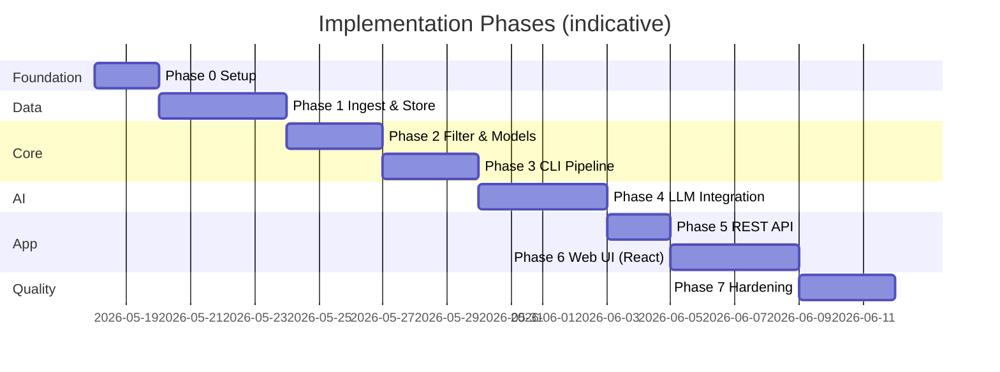

# Phase-Wise Implementation Plan

> **Sources:** [`docs/context.md`](./context.md) · [`docs/architecture.md`](./architecture.md)  
> **Generated:** 2026-05-17  
> **Stack (default):** Python 3.11+, FastAPI, Hugging Face `datasets`, Groq LLM API

---

## Overview

This plan delivers the AI-powered restaurant recommendation system in **seven phases**, each producing a testable increment. Phases follow the architecture principle of **progressive complexity**: data first, then deterministic filtering, then LLM reasoning, then API and UI.



**Estimated total:** ~24 working days (adjust for team size and familiarity).

---

## Phase Summary

| Phase | Name | Primary FRs | Exit criterion |
|-------|------|-------------|----------------|
| **0** | Project foundation | — | Repo scaffold, config, CI-ready structure |
| **1** | Data ingestion & store | FR-1, FR-2 | Local `restaurants.parquet` + schema doc |
| **2** | Domain models & filter | FR-4 | Filter returns capped candidates from store |
| **3** | Preferences & CLI (no LLM) | FR-3 | CLI runs filter-only recommendations |
| **4** | LLM recommendation engine | FR-5, FR-6, FR-7 | CLI returns ranked results with explanations |
| **5** | REST API | All (orchestration) | `POST /api/v1/recommendations` works |
| **6** | Web presentation | FR-8 | Browser form → results with all display fields |
| **7** | Hardening & delivery | — | Tests, docs, demo-ready deploy |

---

## Phase 0: Project Foundation

**Goal:** Establish repository structure, dependencies, and configuration so later phases plug into a consistent layout.

**Architecture refs:** §7 Project Structure, §8 Configuration, §9 Security

### Tasks

| # | Task | Owner hint |
|---|------|------------|
| 0.1 | Create project root `restaurant-recommender/` (or use repo root) with `src/`, `tests/`, `config/`, `scripts/`, `data/` (gitignored) | Dev |
| 0.2 | Add `requirements.txt`: `fastapi`, `uvicorn`, `pydantic`, `pandas`, `pyarrow`, `datasets`, `python-dotenv`, `httpx`, `pytest` | Dev |
| 0.3 | Implement `config/settings.py` loading env: `DATASET_NAME`, `DATA_PATH`, `CANDIDATE_LIMIT`, `DEFAULT_TOP_N`, `LLM_*` | Dev |
| 0.4 | Add `.env.example`, `.gitignore` (`.env`, `data/`, `__pycache__`) | Dev |
| 0.5 | Add `src/main.py` stub and `pytest` config; single smoke test `test_settings_load` | Dev |
| 0.6 | Document local setup in `README.md` (venv, install, env vars) | Dev |

### Deliverables

- Runnable empty app (`uvicorn src.main:app` returns health check).
- Configuration contract documented in `.env.example`.

### Acceptance criteria

- [ ] `pip install -r requirements.txt` succeeds on clean machine.
- [ ] Settings load from environment with sensible defaults.
- [ ] No secrets committed to git.

### Dependencies

- None.

**Duration:** 1–2 days

---

## Phase 1: Data Ingestion & Restaurant Store

**Goal:** Load the Hugging Face Zomato dataset, normalize records, persist locally, and expose a queryable store.

**Maps to:** FR-1, FR-2 · Architecture §4.1, §4.2, §5.2

### Tasks

| # | Task | Details |
|---|------|---------|
| 1.1 | **Schema discovery** | Load `ManikaSaini/zomato-restaurant-recommendation`; print columns, dtypes, sample rows; write `data/schema.md` |
| 1.2 | **Field mapping config** | Map raw columns → canonical `Restaurant` fields in `config/field_mapping.yaml` or `settings.py` |
| 1.3 | **`src/ingest/loader.py`** | `load_raw_dataset()` using Hugging Face `datasets` |
| 1.4 | **`src/ingest/normalize.py`** | Location trim/title-case; cuisine split; rating coerce; cost numeric; assign stable `id` |
| 1.5 | **Budget tier logic** | Compute global or per-city percentiles → `budget_tier` (`low` / `medium` / `high`); document thresholds in `data/schema.md` |
| 1.6 | **Validation & ingest job** | Skip invalid rows; log counts; fail if valid row % &lt; 90%; `scripts/run_ingest.py` writes `data/restaurants.parquet` |
| 1.7 | **`src/data/models.py`** | Pydantic/dataclass `Restaurant` matching architecture schema |
| 1.8 | **`src/data/store.py`** | Load parquet into memory; methods: `get_all()`, `filter_by_location()`, `get_by_ids()`; build simple indexes (dict by city, cuisine set) |
| 1.9 | **Unit tests** | `test_normalize.py` (sample rows), `test_store.py` (load fixture parquet) |

### Deliverables

- `data/restaurants.parquet` (generated locally, not committed).
- `data/schema.md` with column mapping and budget rules.
- `RestaurantStore` usable by filter service.

### Acceptance criteria

- [ ] Ingest completes without error on full dataset.
- [ ] Every stored record has `name`, `location_normalized`, `cuisines`, `rating`, `cost_estimate`, `budget_tier`.
- [ ] Store returns &gt; 0 restaurants for at least two test cities (e.g. Bangalore, Delhi).
- [ ] Re-running ingest is idempotent (same row count ± skipped rows).

### Dependencies

- Phase 0 complete.

**Duration:** 3–4 days

**Risks:** Unknown HF schema → mitigate with Phase 1.1 before coding normalize (Architecture §13).

---

## Phase 2: Domain Models & Candidate Filter

**Goal:** Implement preference validation and deterministic filtering with relaxation policy—no LLM yet.

**Maps to:** FR-4 · Architecture §4.4

### Tasks

| # | Task | Details |
|---|------|---------|
| 2.1 | **`UserPreferences` model** | Fields per architecture §4.3; Pydantic validators for budget enum, rating 0–5, `top_n` default 5 max 20 |
| 2.2 | **`CandidateList` model** | `preferences`, `restaurants[]`, `metadata` (count, `filters_relaxed[]`) |
| 2.3 | **`src/services/filter.py`** | `CandidateFilterService.get_candidates(prefs) -> CandidateList` |
| 2.4 | **Filter pipeline** | Order: location → cuisine → min_rating → budget → sort by rating desc → cap `CANDIDATE_LIMIT` |
| 2.5 | **Relaxation policy** | If zero results: relax cuisine, then budget; record in metadata |
| 2.6 | **Unit tests** | Fixture store (10–20 rows): strict match, zero-match relaxation, cap at 30 |

### Deliverables

- `CandidateFilterService` with documented relaxation behavior.
- Test fixture `tests/fixtures/restaurants_small.parquet`.

### Acceptance criteria

- [ ] Valid preferences return 1–30 candidates when data exists.
- [ ] Impossible strict filters trigger relaxation and metadata reflects it.
- [ ] Filter stage completes in &lt; 100 ms on full local dataset (Architecture §10).
- [ ] No LLM or network calls in this phase.

### Dependencies

- Phase 1 (`RestaurantStore` populated).

**Duration:** 2–3 days

---

## Phase 3: Preferences Input & CLI (Filter-Only MVP)

**Goal:** Accept user preferences via CLI and display filter-ranked results without LLM—proves input → filter → output path.

**Maps to:** FR-3 · Architecture §4.3, §4.7 (Option B)

### Tasks

| # | Task | Details |
|---|------|---------|
| 3.1 | **`src/cli.py`** | argparse or `typer`: `--location`, `--budget`, `--cuisine`, `--min-rating`, `--extras`, `--top-n` |
| 3.2 | **Validation errors** | Pretty-print field errors; exit code 1 on invalid input |
| 3.3 | **Deterministic ranking** | Top-N by rating (stand-in for LLM); template explanation: `"Matches your {cuisine} preference in {location} with rating {rating}."` |
| 3.4 | **Output formatter** | Table: rank, name, cuisine, rating, cost, explanation |
| 3.5 | **Integration test** | CLI against fixture data with known preferences → expected restaurant names in output |

### Deliverables

- `python -m src.cli --location Bangalore --budget medium --cuisine Italian` works end-to-end.

### Acceptance criteria

- [ ] All required preference fields enforced (FR-3).
- [ ] Output includes name, cuisine, rating, estimated cost, explanation (template OK).
- [ ] Success criteria partial: personalized **structured** results without AI yet.

### Dependencies

- Phase 2.

**Duration:** 2–3 days

---

## Phase 4: LLM Recommendation Engine

**Goal:** Integrate prompt builder, LLM gateway, response parser, and enricher; upgrade CLI to AI-ranked recommendations.

**Maps to:** FR-5, FR-6, FR-7 · Architecture §4.5, §4.6

### Tasks

| # | Task | Details |
|---|------|---------|
| 4.1 | **Response schema** | Pydantic models: `LLMRecommendationResponse`, `RecommendationItem` (id, rank, explanation) |
| 4.2 | **`src/services/prompt.py`** | `PromptBuilder.build(preferences, candidates, top_n)` → system + user messages; embed JSON schema |
| 4.3 | **`src/services/llm.py`** | `LLMGateway.complete(messages)` — env key, timeout 30s, retry once; abstract provider interface |
| 4.4 | **`src/services/parser.py`** | Strip markdown fences; parse JSON; validate IDs ⊆ candidate set; enrich from store |
| 4.5 | **Hallucination guardrails** | Reject unknown IDs; optional unique name fallback; deterministic fallback on parse failure |
| 4.6 | **`RecommendationResult` model** | Final API/CLI shape: recommendations[], optional summary, metadata |
| 4.7 | **Wire CLI** | Replace template ranking with full pipeline: filter → prompt → LLM → parse → display |
| 4.8 | **Mock LLM tests** | Fixed JSON response → assert enriched output; test fallback path |
| 4.9 | **Prompt snapshot test** | Golden file for prompt structure given fixed inputs |

### Deliverables

- Working CLI with real LLM API key.
- `.env.example` updated with `LLM_API_KEY`, `LLM_MODEL`.

### Acceptance criteria

- [ ] LLM returns top-N with unique explanations per restaurant (FR-6).
- [ ] Optional `summary` field populated when model supports it (FR-7).
- [ ] No restaurant appears in output that was not in candidate list (grounded recommendations).
- [ ] Parse failure triggers retry then deterministic fallback (Architecture §4.5.3).
- [ ] End-to-end CLI latency acceptable with loading message documented (&lt; 20s p95 target).

### Dependencies

- Phase 3 CLI pipeline.
- Valid `LLM_API_KEY`.

**Duration:** 3–4 days

**Risks:** Cost/latency → use Groq models (e.g., `llama3-8b-8192`); cap candidates at 30.

---

## Phase 5: REST API & Orchestration

**Goal:** Expose the full pipeline via FastAPI for web and external clients.

**Maps to:** All FRs (orchestration) · Architecture §4.8, Appendix A

### Tasks

| # | Task | Details |
|---|------|---------|
| 5.1 | **`src/api/schemas.py`** | Request/response DTOs aligned with Appendix A |
| 5.2 | **`src/api/routes.py`** | `POST /api/v1/recommendations`; `GET /health` |
| 5.3 | **Orchestrator** | `RecommendationService.recommend(prefs)` — validate → filter → prompt → LLM → parse → enrich |
| 5.4 | **Error mapping** | 400 validation, 404 no candidates, 502 LLM error, 504 timeout |
| 5.5 | **Startup hook** | Load store from `DATA_PATH`; optional auto-ingest if missing |
| 5.6 | **API tests** | `TestClient`: mock LLM; assert status codes and response shape |
| 5.7 | **CORS** | Enable for local web UI (Phase 6) |

### Deliverables

- Running API: `uvicorn src.main:app --reload`.
- Example `curl` in README.

### Acceptance criteria

- [ ] `POST /api/v1/recommendations` matches contract in Architecture Appendix A.
- [ ] Health check returns 200 when data file exists.
- [ ] Full pipeline callable without CLI.

### Dependencies

- Phase 4.

**Duration:** 2 days

---

## Phase 6: Web Presentation Layer

**Goal:** User-friendly UI collecting preferences and displaying recommendation cards.

**Maps to:** FR-8 · Architecture §4.7 (Option A)

### Tasks

| # | Task | Details |
|---|------|---------|
| 6.1 | **Choose UI approach** | Default: React SPA via Vite in `frontend/` (Modern web frontend) |
| 6.2 | **Preference form** | Location **dropdown** (areas/localities) + budget select + cuisine text + min rating number + extras textarea + submit |
| 6.3 | **API integration** | `fetch` POST to `/api/v1/recommendations`; JSON body from form |
| 6.4 | **Loading state** | Disable submit; spinner during LLM call (2–15s) |
| 6.5 | **Results view** | Card per item: name, cuisine, rating, cost, explanation; summary banner if present |
| 6.6 | **Error UX** | Validation errors, no results, timeout/network messages |
| 6.7 | **Serve frontend** | Run via `npm run dev` in development, build to static for production if needed |
| 6.8 | **Manual test checklist** | 3 preference scenarios documented in README |

**Implementation note (location dropdown contract):**

- The UI should populate the location dropdown from `GET /api/v1/locations`.
- The dropdown values should be **areas/localities** (e.g. `Indiranagar`, `Bellandur`), not just the city name (e.g. `Bangalore`).

### Deliverables

- `web/index.html` (+ assets if any).
- Screenshot-worthy demo flow.

### Acceptance criteria

- [ ] User can submit preferences in browser and see top-N results (Context success criteria).
- [ ] Each card shows: name, cuisine, rating, estimated cost, AI explanation (FR-8).
- [ ] Loading and error states visible.
- [ ] Works against local API with CORS.

### Dependencies

- Phase 5.

**Duration:** 2–3 days

---

## Phase 7: Hardening, Testing & Delivery

**Goal:** Production-minded quality for demo and handoff—not full production infra (out of scope per context).

**Maps to:** Architecture §10, §11, §13 · Context success criteria

### Tasks

| # | Task | Details |
|---|------|---------|
| 7.1 | **Test coverage** | Unit: filter, normalize, parser; integration: API + mock LLM; golden test for filter |
| 7.2 | **Logging** | Structured logs: request id, filter count, LLM latency, token usage (no PII) |
| 7.3 | **Input hardening** | Max length on strings; sanitize `extras` |
| 7.4 | **README completion** | Setup, ingest, run API, run UI, env vars, example requests |
| 7.5 | **Demo script** | 2–3 canned preference sets that reliably return results |
| 7.6 | **Optional container** | `Dockerfile` + `docker-compose` for one-command demo |
| 7.7 | **Final review** | Trace FR-1–FR-8 in traceability matrix below |

### Deliverables

- Test suite green in CI (GitHub Actions or local script).
- Demo-ready application.

### Acceptance criteria (project success — from context)

- [ ] User enters preferences → receives top recommendations with required fields.
- [ ] Recommendations reflect location, budget, cuisine, rating constraints.
- [ ] Each item has clear AI-generated explanation.
- [ ] Full flow: **ingest → input → filter → LLM → display**.

### Dependencies

- Phases 0–6 complete.

**Duration:** 2–3 days

---

## Requirements Traceability Matrix

| FR | Phase(s) | Component |
|----|----------|-----------|
| FR-1 | 1 | `ingest/loader.py`, `run_ingest.py` |
| FR-2 | 1 | `ingest/normalize.py`, `data/store.py`, `data/schema.md` |
| FR-3 | 3, 6 | `UserPreferences`, CLI, web form |
| FR-4 | 2 | `services/filter.py` |
| FR-5 | 4 | `services/prompt.py` |
| FR-6 | 4 | `services/llm.py`, `services/parser.py` |
| FR-7 | 4 | Optional `summary` in parser/models |
| FR-8 | 3 (CLI), 6 (web) | CLI table, web cards |

---

## Critical Path

```
Phase 0 → Phase 1 → Phase 2 → Phase 3 → Phase 4 → Phase 5 → Phase 6 → Phase 7
                              ↑
                    (blocking: data + filter before LLM)
```

**Parallelization opportunities:**

- Phase 6 UI mockups can start during Phase 5 (static HTML against mocked JSON).
- Phase 7 logging patterns can begin during Phase 4.
- `data/schema.md` from Phase 1.1 unblocks accurate filter tests in Phase 2.

---

## Milestone Checkpoints

| Milestone | After phase | Demo |
|-----------|-------------|------|
| **M1: Data ready** | 1 | Show parquet stats, sample restaurants per city |
| **M2: Smart shortlist** | 2 | Filter Bangalore + Italian + medium → candidate list |
| **M3: CLI MVP** | 3 | CLI table without API costs |
| **M4: AI recommendations** | 4 | CLI with explanations from LLM |
| **M5: API live** | 5 | `curl` returns JSON recommendations |
| **M6: Product demo** | 6 | Browser end-to-end |
| **M7: Release candidate** | 7 | Tests pass, README complete |

---

## Testing Plan by Phase

| Phase | Tests to add |
|-------|----------------|
| 0 | Settings load smoke test |
| 1 | Normalize units, store load, ingest on tiny slice |
| 2 | Filter strict/relax/cap cases |
| 3 | CLI integration with fixtures |
| 4 | Mock LLM parser/enricher; prompt snapshot |
| 5 | API contract + error codes |
| 6 | Manual E2E checklist (automate optional with Playwright later) |
| 7 | CI pipeline, coverage gate optional |

---

## Configuration Checklist (Before Phase 4)

| Variable | Required from phase |
|----------|---------------------|
| `DATASET_NAME` | 1 |
| `DATA_PATH` | 1 |
| `CANDIDATE_LIMIT` | 2 |
| `DEFAULT_TOP_N` | 3 |
| `BUDGET_LOW_MAX` / `BUDGET_MEDIUM_MAX` | 1 (after schema discovery) |
| `LLM_API_KEY` | 4 |
| `LLM_MODEL` | 4 |
| `LLM_TIMEOUT_SEC` | 4 |

---

## Out of Scope (Do Not Implement in These Phases)

Per [`context.md`](./context.md):

- User accounts, auth, saved history
- Maps, reservations, live availability
- Custom model training
- Mobile native apps
- Redis/Postgres (optional post-MVP per Architecture §6.2)

---

## Open Decisions — Resolve During Implementation

| Decision | Resolve in phase | Default |
|----------|------------------|---------|
| HF column names | 1.1 | Document in `data/schema.md` |
| Budget tier thresholds | 1.5 | Global 33/66 percentiles |
| LLM provider | 4.3 | Groq API |
| UI framework | 6.1 | React + Vite |
| Top N default | 3.1 | 5 |

---

## Related Documents

| Document | Role |
|----------|------|
| [`docs/context.md`](./context.md) | Objectives, FRs, success criteria |
| [`docs/architecture.md`](./architecture.md) | Components, APIs, diagrams |
| [`docs/implementation-plan.md`](./implementation-plan.md) | This file — phased execution |
| [`docs/problemstatement.txt`](./problemstatement.txt) | Original brief |
